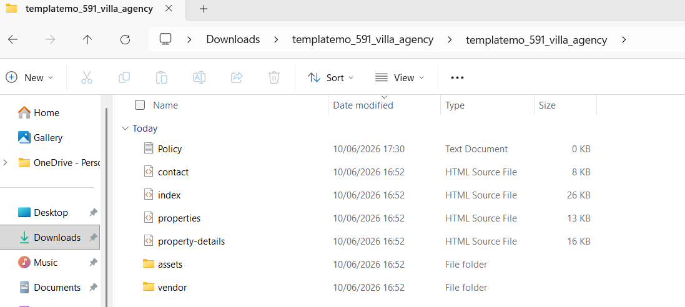
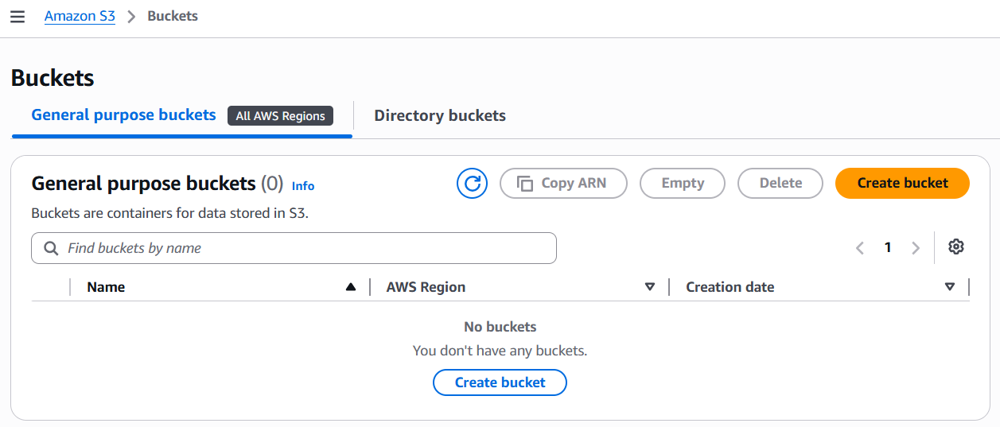
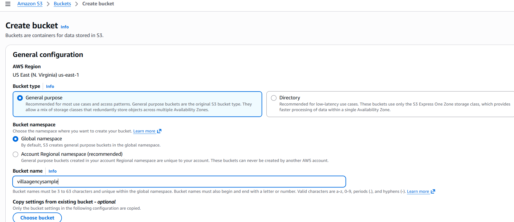
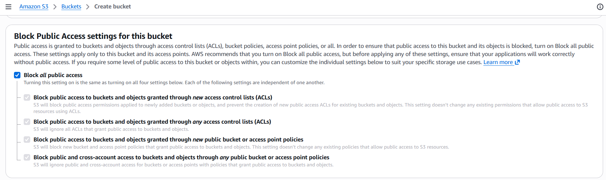
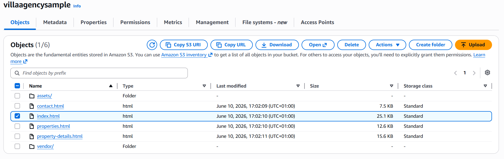
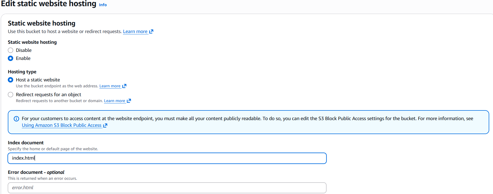
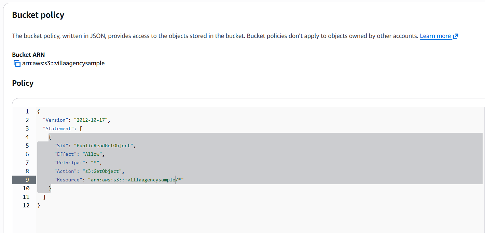
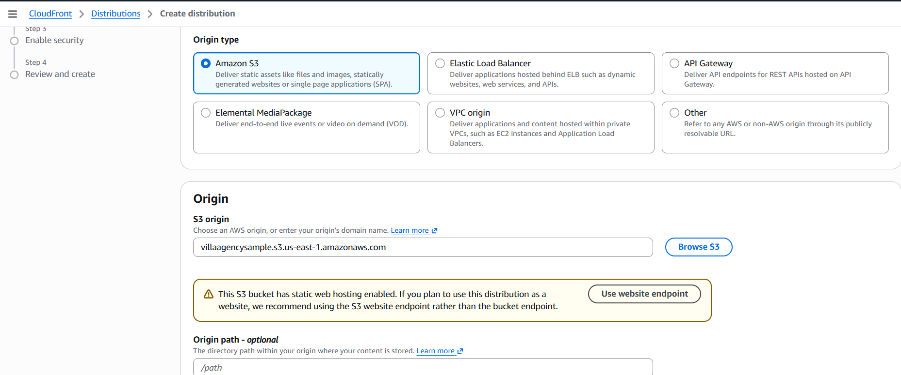
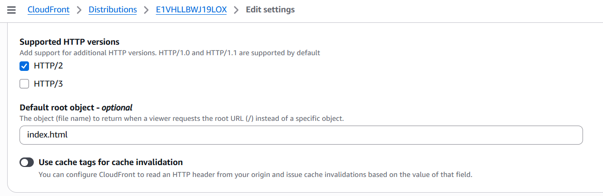
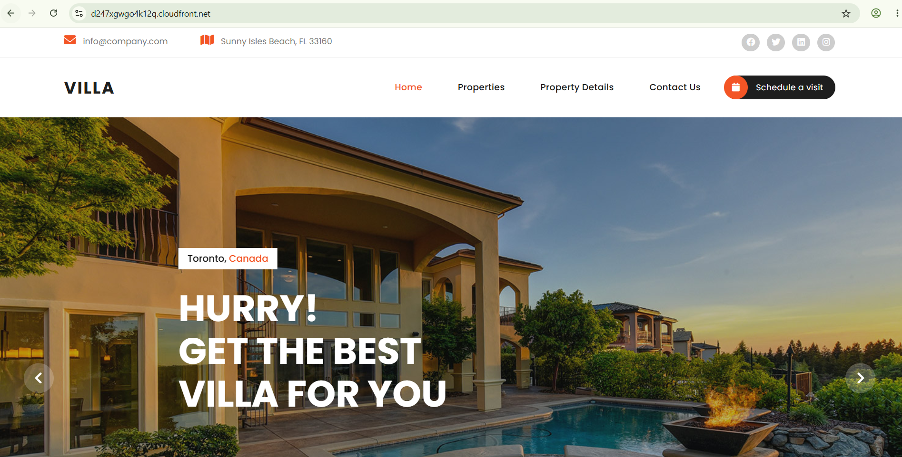

# Hosting a Static Website on Amazon S3

## Project Overview

This project demonstrates how to host a static HTML and CSS website using Amazon S3. The website files were uploaded to an S3 bucket, configured for static website hosting, and made publicly accessible through a bucket policy.

---

## Prerequisites

Before starting, ensure you have:

* An AWS Account
* Access to Amazon S3
* A completed HTML/CSS website project
* Visual Studio Code (VS Code)

---

## Step 1: Prepare Website Files

The first step was to prepare the website files that would be hosted on Amazon S3.

The website consisted of:

* HTML files
* CSS files
* Images and other assets

---

## Step 2: Create an S3 Bucket

1. Logged into AWS Management Console.
2. Navigated to Amazon S3.
3. Clicked **Create Bucket**.

---

## Step 3: Configure the Bucket

During bucket creation:

* Entered a unique bucket name.
* Selected the preferred AWS Region.
* Disabled Block Public Access to allow public website access.
* Confirmed the warning and continued.

---

## Step 4: Upload Website Files

After creating the bucket:

1. Opened the bucket.
2. Clicked **Upload**.
3. Selected all website files and folders.
4. Completed the upload process.

### Screenshot

---

## Step 5: Enable Static Website Hosting

To host the website:

1. Opened the bucket.

2. Selected the **Properties** tab.

3. Scrolled to **Static Website Hosting**.

4. Clicked **Edit**.

5. Enabled Static Website Hosting.

6. Entered:

   * Index document: `index.html`

7. Saved the configuration.

---

## Step 6: Configure Bucket Policy

To allow public access to the website:

1. Opened the **Permissions** tab.
2. Navigated to **Bucket Policy**.
3. Added a policy granting public read access to bucket objects.
4. Saved the policy.

---

## Step 7: Access the Hosted Website

After configuring the bucket:

1. Returned to the uploaded objects.
2. Opened the website endpoint URL.
3. Verified that the website loaded successfully.

---

## Result

The static website was successfully deployed and hosted using Amazon S3. Users can access the website through the S3 website endpoint URL.

###

[Visit My Website](https://villaagencysample.s3.us-east-1.amazonaws.com/index.html)

---

## Conclusion

Amazon S3 provides a simple and cost-effective solution for hosting static websites. By creating a bucket, enabling static website hosting, configuring public access permissions, and uploading website files, a fully functional website can be deployed and accessed online.

---
## Hosting the Static Website with Amazon CloudFront
Project Extension

After successfully hosting the static website on Amazon S3, the next step was to improve performance and content delivery by configuring Amazon CloudFront. CloudFront is AWS's Content Delivery Network (CDN), which caches website content at edge locations around the world, reducing latency and improving load times for users.

---
## Create a CloudFront Distribution

Navigated to Amazon CloudFront from the AWS Management Console.
Clicked Create Distribution.
Under Origin domain, selected the existing S3 bucket containing the static website.
Left the default protocol policy settings.
Configured the remaining settings as required.

---
## Configure the Default Root Object

To ensure the website loads correctly when users visit the CloudFront URL:

Scrolled to the Default Root Object section.

Entered: index.html

Saved the configuration.

---
## Access the Website Through CloudFront

Once the distribution deployment completed:

Opened the CloudFront distribution.
Copied the Distribution Domain Name.
Accessed the website using the CloudFront URL.

Visit:

https://d247xgwgo4k12q.cloudfront.net

---
## Benefits of Using Amazon CloudFront

Using Amazon CloudFront provides several advantages:

Faster website loading through global edge locations.

Reduced latency for users across different geographic regions.

Improved scalability during periods of high traffic.

HTTPS support for secure content delivery.

Better performance by caching static content closer to users.

---
## Conclusion

By integrating Amazon CloudFront with the existing Amazon S3 static website, the website benefits from AWS's global Content Delivery Network (CDN). CloudFront improves website performance, reduces latency, and provides a more scalable and efficient method of delivering static web content to users worldwide.